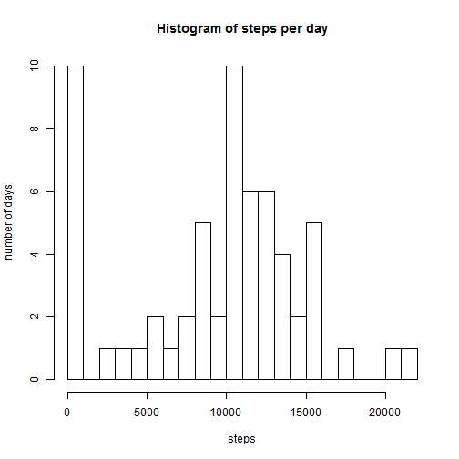
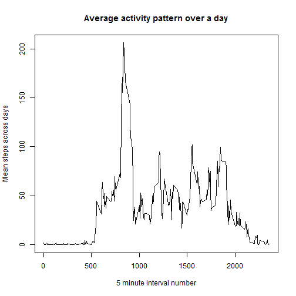
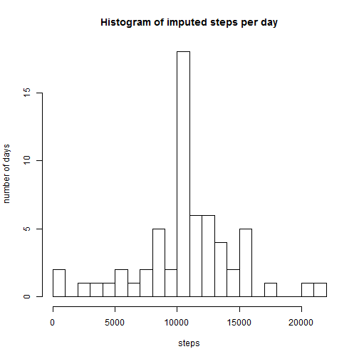
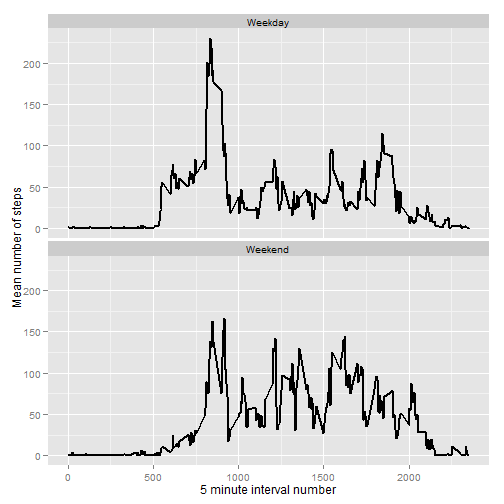

# Reproducible Research: Peer Assessment 1   
-----------

-----------
## Loading and preprocessing the data
-----------
Here, I just load the data. Any processing is done in a question specific manner below.

```r
activity <- read.csv("activity.csv")
```
   

-----------
## What is mean total number of steps taken per day?
-----------

First, get the total number of steps per day using the plyr package:

```r
library(plyr)
stepsPerDay <- ddply(activity,.(date), summarize, steps = sum(steps, na.rm=T))
```

### Histogram of the data

```r
hist(stepsPerDay$steps, breaks=20, main="Histogram of steps per day", xlab = "steps", ylab = "number of days")
```

 

### Mean steps per day:


```r
mean(stepsPerDay$steps, na.rm=T)
```

```
## [1] 9354
```

### Median steps per day:

```r
quantile(stepsPerDay$steps, 0.5, na.rm=T)
```

```
##   50% 
## 10395
```

-----------
## What is the average daily activity pattern?
-----------

First, get the average daily activity pattern using the plyr package:

```r
library(plyr)
stepsPerInterval <- ddply(activity,.(interval), summarize, steps = mean(steps, na.rm=T))
```

### Timeseries of average activity
Plot of the average activity pattern (mean number of step) over 5 minute intervals:

```r
with(stepsPerInterval,plot(x=interval,y=steps,type="l",xlab="5 minute interval number", ylab = "Mean steps across days", main="Average activity pattern over a day"))
```

 

### Which 5 minute interval has the most activity?

```r
which(stepsPerInterval$steps==max(stepsPerInterval$steps))
```

```
## [1] 104
```

-----------
## Imputing missing values
-----------

### Total number of NAs in the dataset

```r
sum(is.na(activity$steps))
```

```
## [1] 2304
```

### Imputing the missing values using the mean number of steps per interval
First, generate the mean number of steps per interval (as above):

```r
library(plyr)
stepsPerInterval <- ddply(activity,.(interval), summarize, steps = mean(steps, na.rm=T))
```

Using a loop, create a vector of imputed values. If an NA is found in steps, replace the value with the mean number of steps for that interval of the day.


```r
#create a list called stepsImpute, fill with NAs
stepsImpute <- vector("list",nrow(activity))

#Loop through rows of activity to impute values
for (row in seq(1:nrow(activity))) {
  #if current row has NA, then impute using the average steps for that interval
  if (is.na(activity[row,]$steps)) {
    stepsImpute[[row]] <- stepsPerInterval$steps[[which(stepsPerInterval$interval==activity[row,]$interval)]]
  } else {
    stepsImpute[[row]] <- activity[row,]$steps
  }
}
```

### Add the imputed data back into the original dataset

```r
activity$stepsImputed <- unlist(stepsImpute)
```

### Histogram, mean and median of the imputed data
Create a new dataframe with total steps per day using the imputed values:


```r
library(plyr)
stepsPerDayImputed <- ddply(activity,.(date), summarize, steps = sum(stepsImputed, na.rm=T))
```

#### Histogram

```r
hist(stepsPerDayImputed$steps, breaks=20, main="Histogram of imputed steps per day", xlab = "steps", ylab = "number of days")
```

 

#### Mean number of imputed steps per day:


```r
mean(stepsPerDayImputed$steps, na.rm=T)
```

```
## [1] 10766
```

#### Median imputed steps per day:

```r
quantile(stepsPerDayImputed$steps, 0.5, na.rm=T)
```

```
##   50% 
## 10766
```

#### Comparing to the non-imputed data
As can be seen below, imputing missing steps by the mean number of steps per interval increases both the mean and median.


```r
comparison <- data.frame(mean=c(mean(stepsPerDay$steps, na.rm=T),mean(stepsPerDayImputed$steps, na.rm=T)),median=c(quantile(stepsPerDay$steps, 0.5, na.rm=T),quantile(stepsPerDayImputed$steps, 0.5, na.rm=T)),row.names=c("original","imputed"))

comparison
```

```
##           mean median
## original  9354  10395
## imputed  10766  10766
```


-----------
## Are there differences in activity patterns between weekdays and weekends?
-----------
* First, code which day of the week the date is in a variable called 'day'
* Second, code whether it is the weekend or weekday in a variable called 'weekday'
* Note: 'date' is converted from factor to POSIX using the lubridate package

```r
library(lubridate)
```

```
## 
## Attaching package: 'lubridate'
## 
## The following object is masked from 'package:plyr':
## 
##     here
```

```r
activity$day <- weekdays(ymd(activity$date))
activity$weekday <- as.factor(ifelse(activity$day %in% c("Saturday","Sunday"),"Weekend","Weekday"))
```

Now, create a new dataset coding the average steps per interval for weekends and weekdays

```r
stepsPerIntervalSplit <- ddply(activity, .(weekday,interval), summarize, steps = mean(stepsImputed))
```

#### Time series plot weekends vs. weekdays 
Uses the ggplot2 package:

```r
library(ggplot2)
p <- ggplot(stepsPerIntervalSplit,aes(interval,steps)) + geom_line(size=1) + facet_wrap(~weekday,ncol=1) + ylab("Mean number of steps") + xlab("5 minute interval number")

p
```

 
